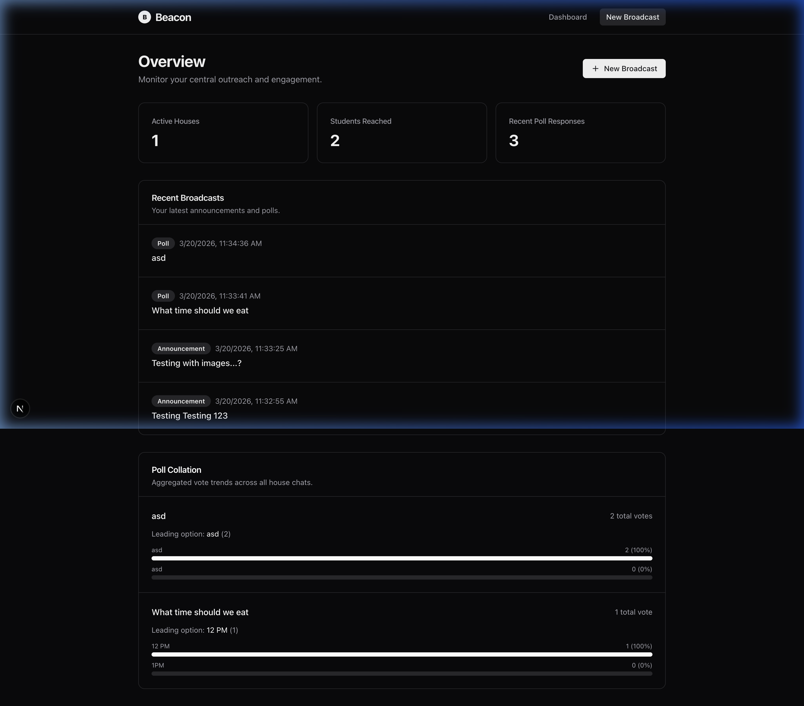
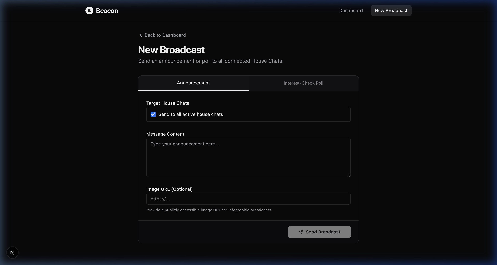

<a id="readme-top"></a>

<!-- PROJECT LOGO -->
<br />
<div align="center">
  <div style="background-color: #fafafa; width: 80px; height: 80px; border-radius: 50%; display: flex; align-items: center; justify-content: center; margin: 0 auto; box-shadow: 0 4px 6px -1px rgb(0 0 0 / 0.1);">
    <span style="color: #18181b; font-size: 40px; font-weight: 900; font-family: sans-serif;">B</span>
  </div>

<h3 align="center">Beacon</h3>

  <p align="center">
    Centralized communication, decentralized outreach. A powerful Telegram integration for College Student Committees.
    <br />
    <a href="#usage"><strong>Explore the docs »</strong></a>
    <br />
    <br />
    <a href="https://github.com/chaipinzheng/beacon">View Demo</a>
    ·
    <a href="https://github.com/chaipinzheng/beacon/issues/new?labels=bug&template=bug-report---.md">Report Bug</a>
    ·
    <a href="https://github.com/chaipinzheng/beacon/issues/new?labels=enhancement&template=feature-request---.md">Request Feature</a>
  </p>
</div>

<!-- TABLE OF CONTENTS -->
<details>
  <summary>Table of Contents</summary>
  <ol>
    <li>
      <a href="#about-the-project">About The Project</a>
      <ul>
        <li><a href="#built-with">Built With</a></li>
      </ul>
    </li>
    <li>
      <a href="#getting-started">Getting Started</a>
      <ul>
        <li><a href="#prerequisites">Prerequisites</a></li>
        <li><a href="#installation">Installation</a></li>
      </ul>
    </li>
    <li><a href="#usage">Usage</a></li>
    <li><a href="#roadmap">Roadmap</a></li>
    <li><a href="#contributing">Contributing</a></li>
    <li><a href="#contact">Contact</a></li>
  </ol>
</details>

<!-- ABOUT THE PROJECT -->
## About The Project

[![Beacon Dashboard Screen Shot][product-screenshot]](https://github.com/chaipinzheng/beacon)

Beacon bridges the gap between the College Student Committee (CSC) and individual House Chats. By leveraging Telegram's native APIs and a powerful Next.js dashboard, Beacon streamlines outreach, announcements, and feedback collection while maintaining a standardized message flow.

**Value Proposition:**
* **Centralized Communication, Decentralized Outreach:** Allows the CSC to broadcast messages from a single interface while reaching students directly in their decentralized House Chats.
* **Stronger Coordination:** Enhances alignment and communication efficiency between the CSC and the various Houses.
* **Standardized Message Flow:** Ensures that announcements, infographics, and polls are delivered consistently and professionally across all channels.

<p align="right">(<a href="#readme-top">back to top</a>)</p>

### Built With

* [![Next][Next.js]][Next-url]
* [![React][React.js]][React-url]
* [![TailwindCSS][TailwindCSS]][TailwindCSS-url]
* [![Supabase][Supabase]][Supabase-url]

<p align="right">(<a href="#readme-top">back to top</a>)</p>

<!-- GETTING STARTED -->
## Getting Started

To get a local copy up and running, follow these simple steps.

### Prerequisites

You need Node.js installed, as well as a Supabase project and a Telegram Bot Token.
* npm
  ```sh
  npm install npm@latest -g
  ```

### Installation

1. Get a free API Key at [https://supabase.com](https://supabase.com)
2. Get a free Telegram Bot Token from [@BotFather](https://t.me/BotFather) on Telegram
3. Clone the repo
   ```sh
   git clone https://github.com/chaipinzheng/beacon.git
   ```
4. Install NPM packages inside the `web` directory
   ```sh
   cd web
   npm install
   ```
5. Set up your Database Schema in Supabase using the provided `.sql` file in `web/supabase/schema.sql`.
6. Enter your API keys in `web/.env.local`
   ```env
   NEXT_PUBLIC_SUPABASE_URL="ENTER YOUR SUPABASE URL"
   SUPABASE_SERVICE_ROLE_KEY="ENTER YOUR SUPABASE SERVICE ROLE KEY"
   TELEGRAM_BOT_TOKEN="ENTER YOUR TELEGRAM BOT TOKEN"
   ```
7. Run the development server
   ```sh
   npm run dev
   ```

<p align="right">(<a href="#readme-top">back to top</a>)</p>

<!-- USAGE EXAMPLES -->
## Usage

Beacon comes with two core pages tailored for the CSC workflow:

**1. The Dashboard**
Monitor active houses, reach statistics, and recent broadcasts centrally.


**2. The Compose Interface**
Draft rich-text announcements or interactive "Interest-Check" Polls with dynamic options.


_For more examples, please refer to the [Documentation](https://example.com)_

<p align="right">(<a href="#readme-top">back to top</a>)</p>

<!-- ROADMAP -->
## Roadmap

- [x] Integrate standard text announcements
- [x] Add multi-option polling support
- [x] Provide unified analytics view
- [ ] Add role-based access control (RBAC)
- [ ] Implement advanced message scheduling

See the [open issues](https://github.com/chaipinzheng/beacon/issues) for a full list of proposed features (and known issues).

<p align="right">(<a href="#readme-top">back to top</a>)</p>

<!-- CONTRIBUTING -->
## Contributing

Contributions are what make the open source community such an amazing place to learn, inspire, and create. Any contributions you make are **greatly appreciated**.

If you have a suggestion that would make this better, please fork the repo and create a pull request. You can also simply open an issue with the tag "enhancement".
Don't forget to give the project a star! Thanks again!

1. Fork the Project
2. Create your Feature Branch (`git checkout -b feature/AmazingFeature`)
3. Commit your Changes (`git commit -m 'Add some AmazingFeature'`)
4. Push to the Branch (`git push origin feature/AmazingFeature`)
5. Open a Pull Request

<p align="right">(<a href="#readme-top">back to top</a>)</p>

<!-- CONTACT -->
## Contact

Project Link: [https://github.com/chaipinzheng/beacon](https://github.com/chaipinzheng/beacon)

<p align="right">(<a href="#readme-top">back to top</a>)</p>

<!-- MARKDOWN LINKS & IMAGES -->
[product-screenshot]: images/dashboard.png
[Next.js]: https://img.shields.io/badge/next.js-000000?style=for-the-badge&logo=nextdotjs&logoColor=white
[Next-url]: https://nextjs.org/
[React.js]: https://img.shields.io/badge/React-20232A?style=for-the-badge&logo=react&logoColor=61DAFB
[React-url]: https://reactjs.org/
[TailwindCSS]: https://img.shields.io/badge/Tailwind_CSS-38B2AC?style=for-the-badge&logo=tailwind-css&logoColor=white
[TailwindCSS-url]: https://tailwindcss.com/
[Supabase]: https://img.shields.io/badge/Supabase-3ECF8E?style=for-the-badge&logo=supabase&logoColor=white
[Supabase-url]: https://supabase.com/
